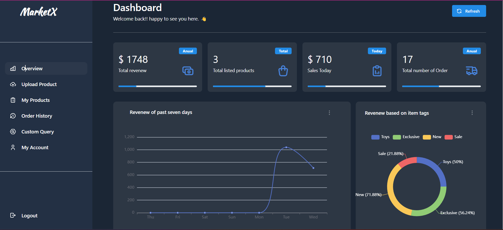
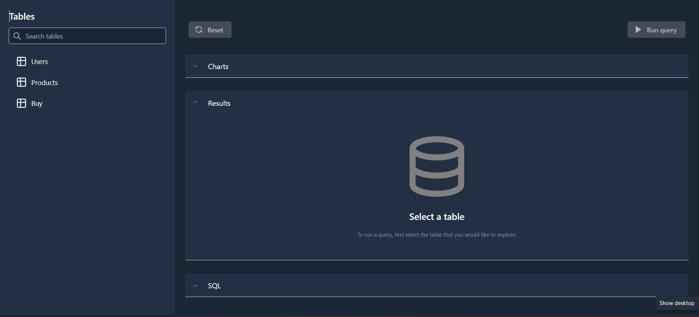
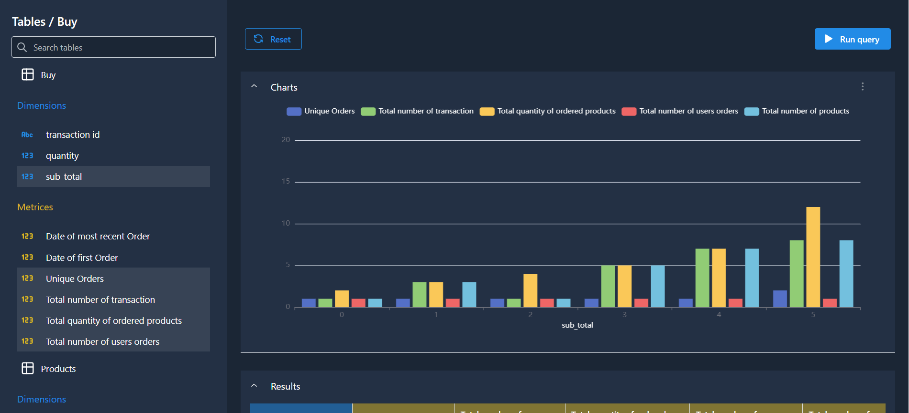
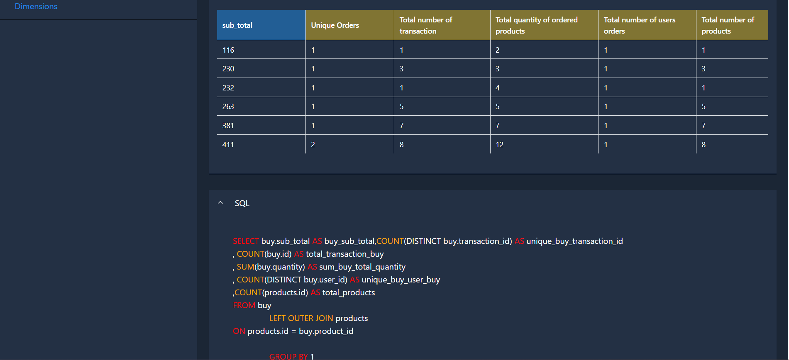

# MarketX

**MarketX** is a beautiful and user-friendly **marketplace** for selling **toys**. You can browse through the wide range of toys, add them to your cart, and buy them whenever you want. You can also check out individual products and see the top 4 best-selling items.

The focal point of this project is the **MarketX Dashboard**, which is a comprehensive dashboard that integrates **Business Intelligence (BI)**. With this dashboard, you can monitor your product's performance on the MarketX shop, view the performance graph from the past seven days, check the order history, review all the uploaded products, and run a wide range of custom queries to gain valuable insights from the MarketX shop.

## MarketX Shop

### Overview


### Payment

For payment with credit cards, you can use followings.

```
Card Number: 4242 4242 4242
MM/YY: 04/24
CVC: 242
Country: United States
ZIP: 77009 OR 77017 OR 77036
```

## MarketX Dashboard

## Overview



**MarketX Dashboard** is an impressive tool that comes with a powerful **BI** feature. This dashboard allows you to keep track of your total revenue, the total number of products listed, revenue based on item tags, revenue from the past 7 days, and today's sales. Additionally, you can upload new products to your **MarketX store** and update the product descriptions. You can also view your order history and run customized queries based on all users, products, and purchases.

## Custom Query



This feature was inspired by an open-source project called **[LightDash](https://github.com/lightdash/lightdash)**, which allows you to run customized queries based on the **users, products,** and **buy** tables. You can join the products table with the users table, as well as the buy table with both the products and users tables to get all the results based on the joined tables. Each table has two fields named **metrics** and **dimensions**. **Metrics are used to perform calculations on your tables**, while **Dimensions are used to segment data in your tables**.



To run your query, first select the matrices and dimensions from the left sidebar. Only select the ones you need for your query. Once you have made your selection, click the "run query" button. This will generate the result table for you.



In the top section, you can view the chart based on your query result, and in the bottom section, you can view the **SQL** command used to generate the result.

You can modify the chart type and download it by clicking on the three dots icon.

## Tech Stack

- Frontend

  - Vite
  - React Js
  - TypeScript
  - Mantine
  - React Echarts
  - Tanstack Query
  - Redux
  - Stripe
  - Axios

- Backend
  - Javascript
  - Node Js
  - Express Js
  - Postgresql
  - Pg
  - AWS S3
